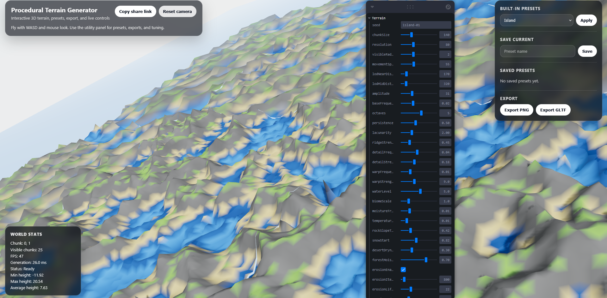
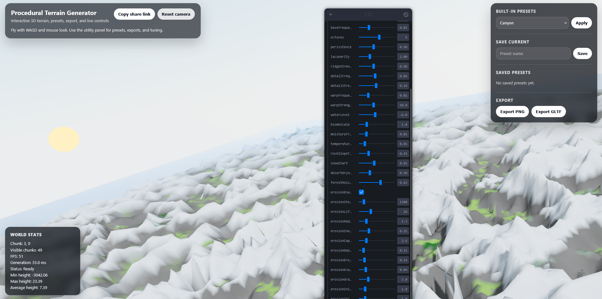
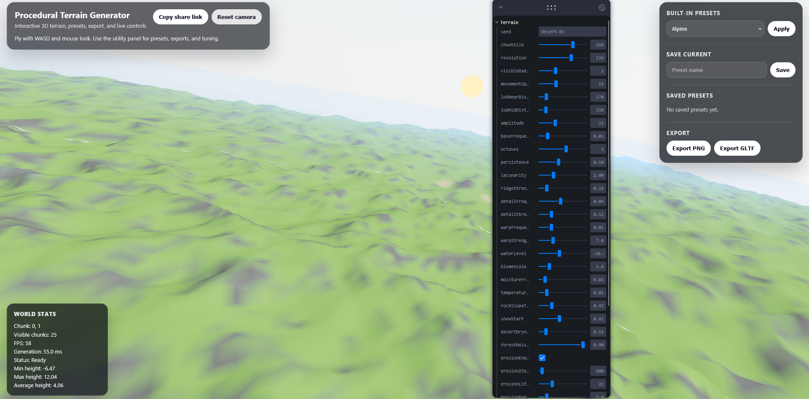

# Procedural Terrain Generator

Real-time procedural terrain engine built with **TypeScript**, **React**, **Three.js**, and **WebGL**. The project generates large-scale procedural landscapes using layered noise functions, hydraulic erosion simulation, biome generation, adaptive level-of-detail rendering, and dynamic chunk streaming.

## Features

* Infinite terrain streaming with dynamic chunk loading and unloading
* Multi-layer procedural terrain generation using fractal noise
* Domain warping for more natural terrain formations
* Hydraulic erosion simulation with sediment transport and deposition
* Biome generation based on environmental parameters
* Adaptive Level-of-Detail (LOD) system for improved performance
* Terrain caching and optimized chunk management
* Real-time exploration of large procedural worlds

## Tech Stack

* TypeScript
* React
* Three.js
* WebGL
* Vite

## Screenshots

### Island Terrain



Large-scale island generation using layered noise functions and procedural terrain shaping.

### Mountain Terrain



Mountainous terrain generated with ridged noise and hydraulic erosion simulation.

### Desert Terrain



Procedurally generated desert biome with custom terrain parameters and environmental blending.

## Technical Highlights

### Procedural Terrain Generation

Implemented multi-octave noise generation with domain warping to create natural terrain features including mountains, valleys, and coastlines.

### Hydraulic Erosion

Simulated droplet-based hydraulic erosion with sediment transport, deposition, evaporation, and erosion radius calculations to produce realistic landforms.

### Infinite World Streaming

Developed a chunk-based terrain streaming system that dynamically loads and unloads terrain around the player, enabling exploration of virtually unlimited worlds.

### Adaptive LOD System

Implemented a distance-based Level-of-Detail system that reduces geometric complexity for distant terrain chunks while maintaining visual quality nearby.

### Biome Generation

Created biome blending using environmental parameters to generate diverse terrain regions such as deserts, grasslands, forests, mountains, and coastal areas.

## Running the Project

```bash
npm install
npm run dev
```

## Building

```bash
npm run build
```

## Future Improvements

* GPU-based terrain generation using GLSL shaders
* Procedural vegetation placement
* River and water simulation
* Terrain export to GLTF/OBJ
* Frustum culling and further rendering optimizations
* Terrain editing tools